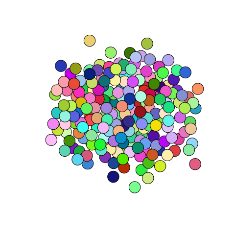
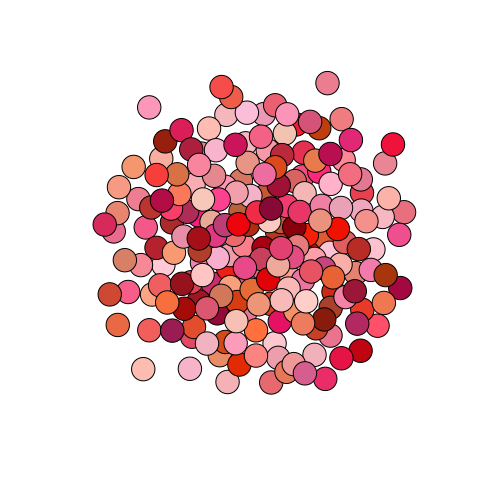
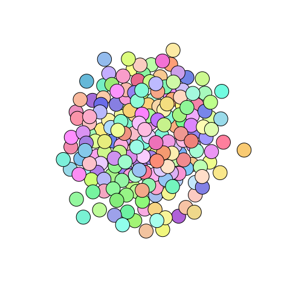
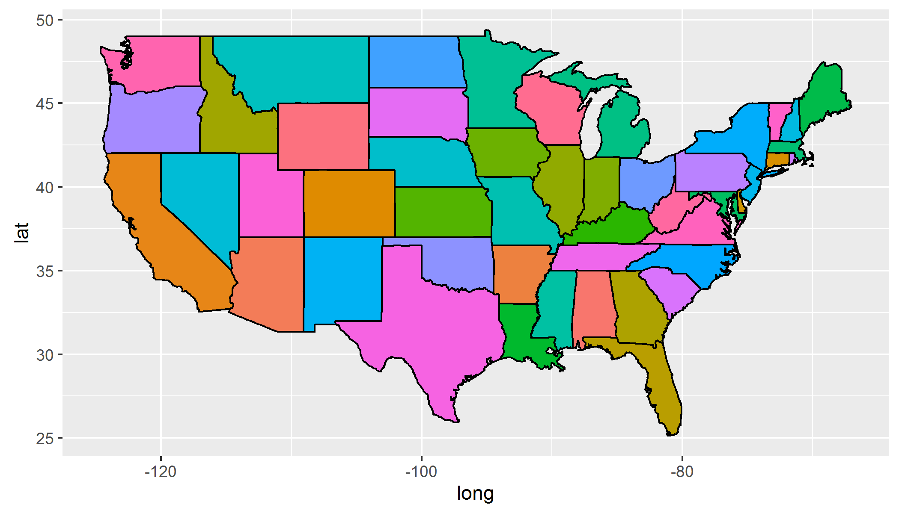
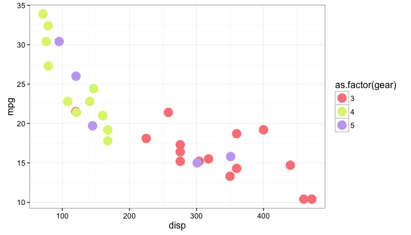
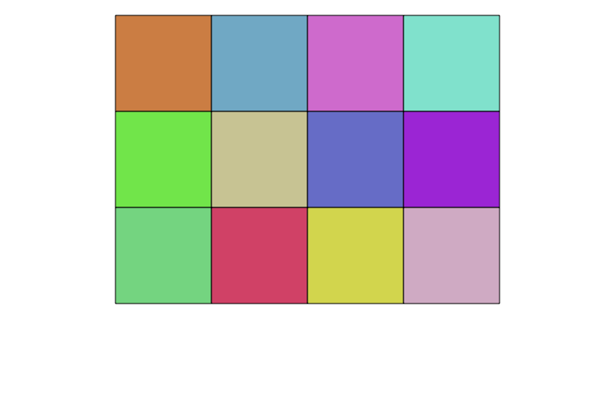
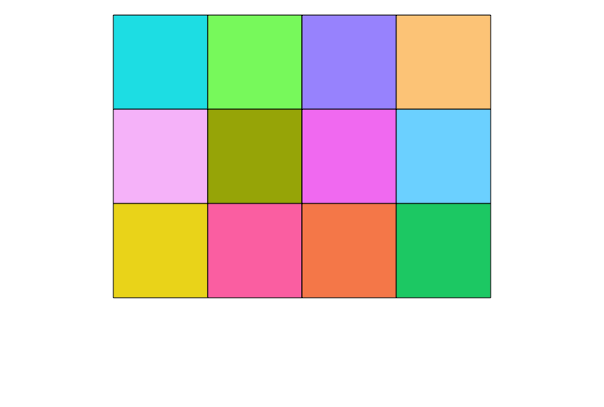

[](https://cran.r-project.org/package=randomcoloR)

# randomcoloR

An [R](https://www.r-project.org/) package for generating attractive and distinctive colors.

The `randomColor()` function is ported from [randomColor.js](https://github.com/davidmerfield/randomColor).

Let's quickly get some pretty random colors.
```r
library(igraph)
library(randomcoloR)

k <- 200
plot(erdos.renyi.game(k, 0.1), vertex.label=NA,
     edge.lty="blank", vertex.color=randomColor(k))
```


We can specify a particular hue, such as red.
```r
plot(erdos.renyi.game(k, 0.1), vertex.label=NA,
     edge.lty="blank", vertex.color=randomColor(k, hue="red"))
```


We can also get random colors with specific luminosity.
```r
plot(erdos.renyi.game(k, 0.1), vertex.label=NA,
     edge.lty="blank", vertex.color=randomColor(k, luminosity="light"))
```


We can also ask for a set of optimally distinct colors so that colors in our plot are not too similar.
If we use `ggplot2` to select the color space for our states in the map below, we get many similar colors.
```r
library(dplyr)
library(ggplot2)
library(maps)

states_map <- map_data("state")

ggplot(states_map, aes(x=long, y=lat, group=group)) +
  geom_polygon(aes(fill=region), color="black") +
  guides(fill=FALSE)
```
*Which states are green?*


Instead, let's find the most distinctive set of colors for all states.
```r
ggplot(states_map, aes(x=long, y=lat, group=group, fill=region)) +
  geom_polygon(color="black") +
  scale_fill_manual(values=distinctColorPalette(length(unique(states_map$region)))) +
  guides(fill=FALSE)
```
*Now, which states are green?*


When using `ggplot2`, we can specify a custom color palette.
```r
ggplot(mtcars, aes(x=disp, y=mpg, col=as.factor(gear))) +
  geom_point(size=5) +
  scale_colour_manual(values=randomColor(length(unique(mtcars$gear)), luminosity="light")) +
  theme_bw()
```


You can use the default color space.

```r
set.seed(8675309)

scales::show_col(distinctColorPalette(12), labels=FALSE)
```



Or an alternate color space.

```r
scales::show_col(distinctColorPalette(12, altCol=TRUE), labels=FALSE)
```



And you can preprocess the color space with t-SNE for improved color separation
in some circumstances

```r
scales::show_col(distinctColorPalette(12, altCol=TRUE, runTsne=TRUE), labels=FALSE)
```


## Installation from Github

To install this package from Github via the R console, type:
```r
devtools::install_git("https://github.com/ronammar/randomcoloR")
```
It's also on [CRAN](https://cran.r-project.org/web/packages/randomcoloR/):
```r
install.packages("randomcoloR")
```
